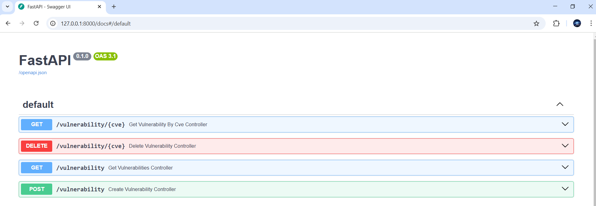

# SwissRE Technical Assessment - C# & Python

This is the solution to SwissRE Technical Assesment. This `README.md` document contains the project setup instructions to run the vulnerability API and the vulnerability CLI. Find the technical assesment instructions in `/docs/technical-assessment`.

# Vulnerability API setup

1. Build the Vulnerability API Docker image:

   ```
   $ cd vulnerability-api
   $ docker build -t fastapi-app .
   ```

2. Run the Docker container with the API:

   ```
   $ docker run -d -p 8000:8000 fastapi-app
   ```

3. You can now play around with the API by accessing swagger (http://127.0.0.1:8000/docs) or calling directly the API (http://127.0.0.1:8000) with Postman or any other HTTP agent.



# Vulnerability CLI setup

1. Build the Vulnerability CLI Docker image:

   ```
   $ cd vulnerability-cli
   $ dotnet build
   $ docker build -t vulnerability-cli .
   ```

2. Run the Docker container:

   ```
   $ docker run --rm vulnerability-cli --file ten_elements.json --url http://host.docker.internal:8000/vulnerability
   ```

3. Check if the vulnerabilities have been inserted successfully.


4. Feel free to test any other API endpoint as well.
